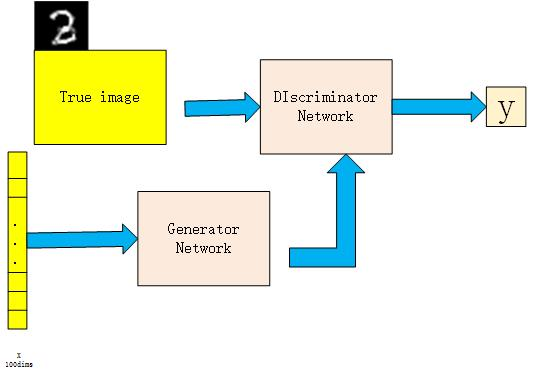
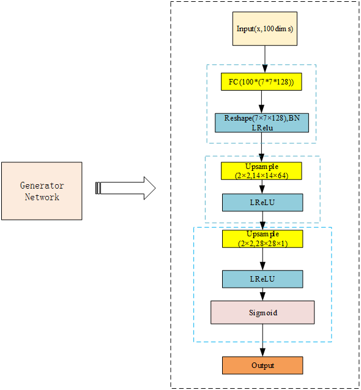
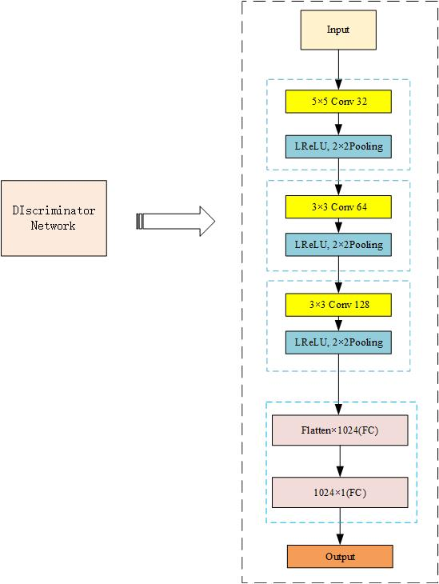
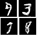

# Using DCGAN to generate MNIST image
This is the file that forks the github [jonbruner](https://github.com/jonbruner/generative-adversarial-networks). We change the network using Up-sample which is like the U-net in the discriminator, and the BN is used in the discriminator part. The RELU is replaced by the LeakyReLU.

## How th use

```shell
python gan_train.py
```

### Requirement
Required python (version 3.5) libraries: Tensorflow (>=1.1) + matplotlib + Numpy.

### The architecture network 
<br>
<br>


### The finaly generative images
<br>
